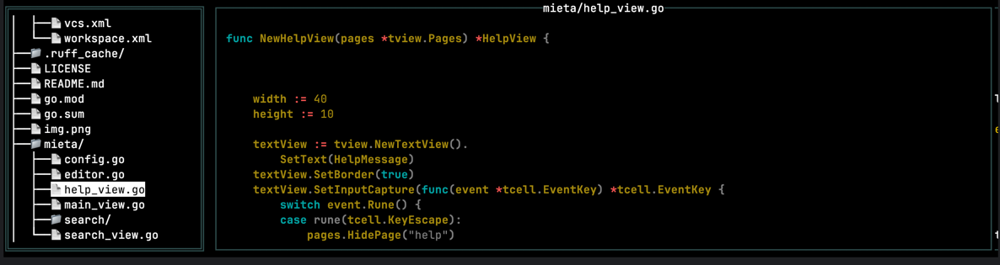
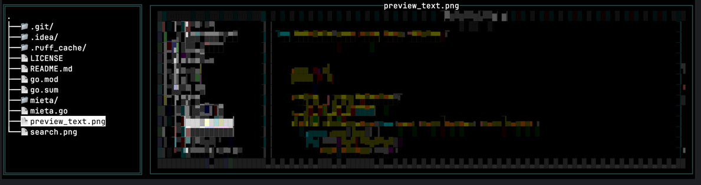
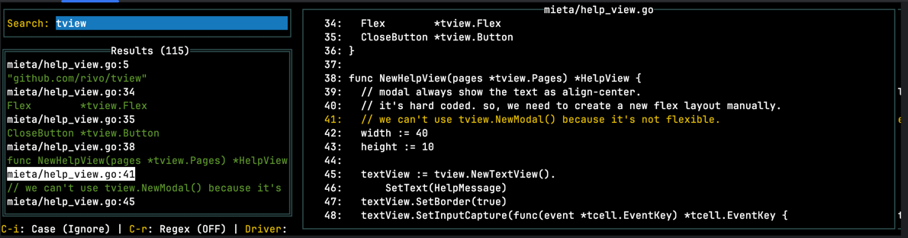

# MIETA - TUI Tool for Directory Tree and File Preview

## Overview
MIETA is a TUI tool that visually displays directory structures in the terminal and allows you to preview the contents of selected files. As the name suggests, it allows you to "see" (MIETA) code and files easily. (The name is, of course, a nod to MIEL.)

| Type            | Image                                   |
|-----------------|-----------------------------------------|
| Preview Text    |    |
| Preview Image   |  |
| Searching       |                |

## Install

```bash
go install github.com/tokuhirom/mieta@latest
```

## Main Features

### Directory Tree Display
-  Displays directory structure in a tree format
-  Automatically excludes `.git` directories and respects `.gitignore` patterns
-  Tree display is asynchronous, ensuring the UI is not blocked even with large directories

### File Preview
-  Shows the contents of selected files with syntax highlighting
-  Supports various programming languages (Python, Go, Terraform, YAML, PHP, Perl, Kotlin, Java, JavaScript, TypeScript, HTML, CSS, Markdown, JSON, Bash, Ruby, Rust, C, C++, C#, etc.)
-  Displays appropriate error messages for binary files or permission errors
-  Supports image preview for common formats (JPG, PNG, GIF, SVG)

### Text Search
-  Full text search across files using powerful search tools (ag/The Silver Searcher or rg/ripgrep)
-  Configurable search options (case sensitivity, regex support)
-  Results displayed with context and highlighted matches
-  Navigate directly to matching lines in files
-  Extensible search driver architecture for adding new search tools

### External Editor Integration
-  Open files directly in your preferred external editor
-  Automatically opens to the current line in preview or matched line in search results
-  Configurable through config file or EDITOR environment variable
-  Supports common editors (vim, emacs, nano, VS Code) with proper line number handling

### Keyboard Navigation
-  Intuitive keyboard shortcuts for efficient navigation
-  File finding by name with incremental search
-  Customizable keybindings through configuration

### Layout
-  Displays the directory tree on the left and file preview on the right
-  The width ratio is dynamically adjustable

### Configuration
-  TOML configuration file for customizing behavior
-  Configurable syntax highlighting themes
-  Customizable search tools and options
-  Customizable keybindings

## Command Line Arguments
-  Allows specifying a directory path at startup
-  Uses the current directory if no path is specified

## Technical Features

### Framework
-  TUI application built using the tview framework

### Asynchronous Processing
-  Directory scanning and search operations are performed asynchronously
-  Ensures responsive UI even during heavy operations

### Error Handling
-  Displays appropriate error messages when files cannot be opened
-  Handles binary files, permission errors, and other IO errors

### Customizable Layout
-  Dynamically adjustable pane widths
-  Flexbox-based layout

## Configuration

MIETA uses a TOML configuration file located at `~/.config/mieta/config.toml`. If the file doesn't exist, a default configuration will be created on first run.

Example configuration:

```toml
# MIETA configuration file

# Syntax highlighting style
# Available styles: monokai, github, vs, xcode, dracula, nord, solarized-dark, solarized-light
chroma_style = "monokai"

# Maximum file size (in bytes) for syntax highlighting
highlight_limit = 1000000

# External editor command
# If not specified, uses EDITOR environment variable
editor = "vim"

# Search settings
[search]
# Default search driver: "ag" or "rg"
driver = "ag"

# Search options
# extra_opts = ["--hidden", "--follow"]

# Keybindings customization
[keymap.files]
# Override default keybindings for files view
# "j" = "FilesScrollDown"
# "k" = "FilesScrollUp"
# "e" = "FilesEdit"

[keymap.help]
# Override default keybindings for help view
# "j" = "HelpScrollDown"
# "k" = "HelpScrollUp"

[keymap.search]
# Override default keybindings for search view
# "j" = "SearchScrollDown"
# "k" = "SearchScrollUp"
# "e" = "SearchEdit"
```

## Keyboard Shortcuts

### Files View
- `j`/`k`: Scroll preview down/up
- `w`/`s`: Move up/down in tree
- `a` or `left`: Navigate up/collapse directory
- `d` or `right`: Expand directory
- `Space`: Scroll preview down one page
- `H`/`L`: Decrease/increase tree width
- `e`: Open current file in external editor
- `f`: Enter find mode (find files by name)
- `/`: Inline search within tree
- `n`/`N`: Find next/previous match
- `S`: Open search view
- `q`: Quit
- `?`: Show help

### Help View
- `j`/`k`: Scroll down/up
- `Esc` or `Enter`: Hide help page

### Search View
- `w`/`s` or `Up`/`Down`: Navigate to previous/next search result
- `j`/`k`: Scroll preview down/up
- `h`/`l`: Scroll preview left/right
- `S`: Focus search input
- `e`: Open current file in external editor
- `G`: Scroll to end of preview
- `H`/`L`: Decrease/increase left panel width
- `Ctrl-R`: Toggle regex search
- `Ctrl-I`: Toggle case sensitivity
- `q` or `Esc`: Exit search view

## Debug Mode

For debugging purposes, you can set the `MIETA_DEBUG` environment variable to a file path where logs will be written:

```bash
MIETA_DEBUG=/tmp/mieta.log mieta /path/to/directory
```

## Future Expansion Possibilities

- Better gitignore support: Respect `.gitignore` rules for filtering files
- Git Integration: Enhanced git status display in the file tree

## Contributing

Contributions are welcome! Feel free to open issues or submit pull requests on GitHub.

## License

```
The MIT License (MIT)

Copyright © 2025 Tokuhiro Matsuno, https://64p.org/ <tokuhirom@gmail.com>

Permission is hereby granted, free of charge, to any person obtaining a copy
of this software and associated documentation files (the "Software"), to deal
in the Software without restriction, including without limitation the rights
to use, copy, modify, merge, publish, distribute, sublicense, and/or sell
copies of the Software, and to permit persons to whom the Software is
furnished to do so, subject to the following conditions:

The above copyright notice and this permission notice shall be included in
all copies or substantial portions of the Software.

THE SOFTWARE IS PROVIDED "AS IS", WITHOUT WARRANTY OF ANY KIND, EXPRESS OR
IMPLIED, INCLUDING BUT NOT LIMITED TO THE WARRANTIES OF MERCHANTABILITY,
FITNESS FOR A PARTICULAR PURPOSE AND NONINFRINGEMENT. IN NO EVENT SHALL THE
AUTHORS OR COPYRIGHT HOLDERS BE LIABLE FOR ANY CLAIM, DAMAGES OR OTHER
LIABILITY, WHETHER IN AN ACTION OF CONTRACT, TORT OR OTHERWISE, ARISING FROM,
OUT OF OR IN CONNECTION WITH THE SOFTWARE OR THE USE OR OTHER DEALINGS IN
THE SOFTWARE.
```
